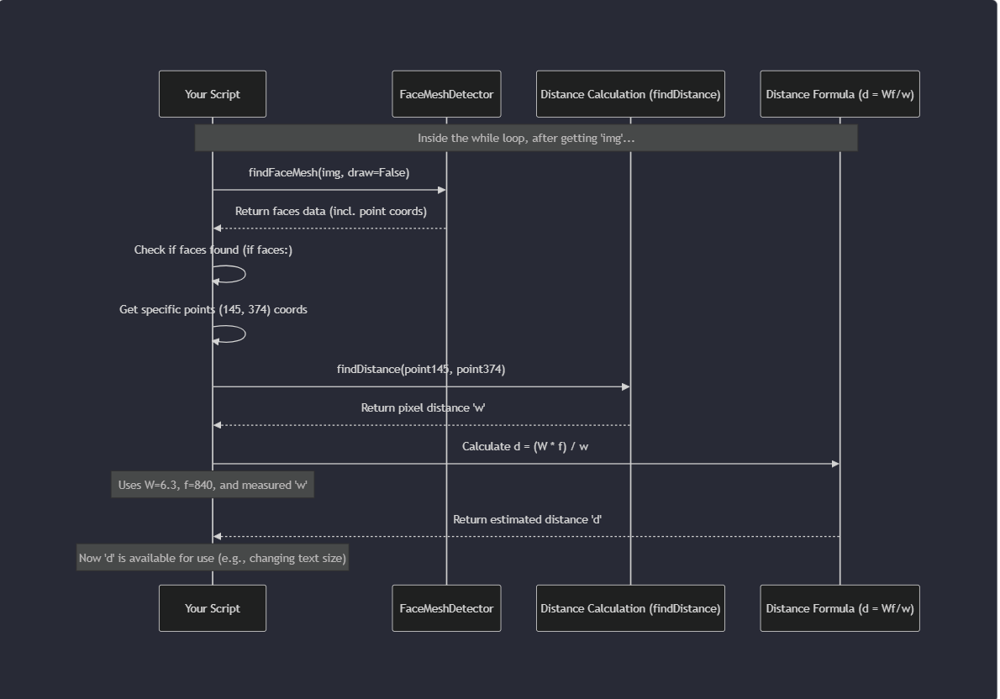
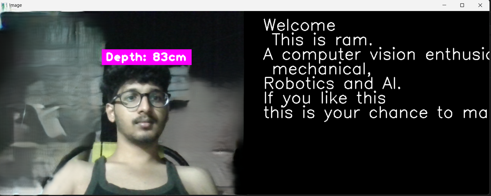
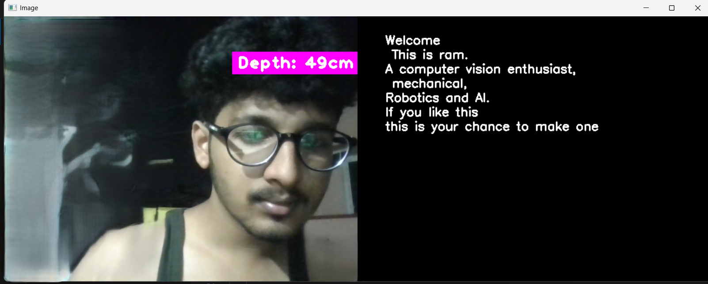

# Face Depth-Based Dynamic Text Display

## Overview
This project uses OpenCV and MediaPipe to measure face depth from a webcam feed and dynamically adjust the size of displayed text based on how close or far your face is from the camera. The closer your face, the larger the text; the farther your face, the smaller the text.

---

## Project Structure

```
face-depth-project/
├── src/
│   ├── FaceDepthMeasurement.py         # Original face mesh and depth measurement logic
│   ├── DynamicTextReader.py            # Original dynamic text display logic
│   ├── DynamicTextWithDepth.py         # New: Demo for dynamic text size based on face depth
│   └── dynamic_font.py                 # New: Helper for font scaling based on pixel height
├── requirements.txt                    # All dependencies (OpenCV, cvzone, mediapipe, numpy)
├── README.md                           # Project documentation (this file)
├── .gitignore                          # Excludes venv, __pycache__, etc.
└── setup_instructions.md               # Step-by-step environment setup guide
```

---

## Logic and Workflow

### Face Detection:
Uses MediaPipe (via cvzone) to detect facial landmarks in real-time from your webcam.

### Depth Estimation:
Calculates the "depth" of your face by measuring the pixel distance between key facial landmarks (e.g., between the eyes or from chin to forehead).

### Dynamic Text Sizing:
A helper function computes the correct OpenCV `fontScale` so that the text height on screen matches a value mapped from your face depth.

- As your face moves **closer**, the measured distance increases, and the text size **grows**.
- As you move **away**, the text **shrinks**.

### Display:
Shows the video feed with dynamically sized text overlayed, updating in real-time as you move.

---

## How to Run

1. Set up your environment (see `setup_instructions.md` for Python version and dependency details).
2. Run one of the scripts:

```bash
python src/FaceDepthMeasurement.py
python src/DynamicTextReader.py
```

For dynamic text sizing demo:

```bash
python src/DynamicTextWithDepth.py
```

---

## Screenshots

Below are example screenshots you can add to your repository for better understanding:

### Workflow Overview  
  
*Pipeline: Webcam → Face Detection → Depth Calculation → Dynamic Text Sizing → Display*

### Enlarging Letters (Face Far from Camera)  
  
*Text becomes larger as the face moves farther from the camera.*

### Smaller Letters (Face close to Camera)  
  
*Text shrinks as the face moves closer to the camera.*

---
---

## Notes

- **Python Version**: For MediaPipe compatibility, use Python **3.7–3.11**.
- **Camera Index**: If you have multiple cameras, you may need to change the index in the code (e.g., `cv2.VideoCapture(0)`, `cv2.VideoCapture(1)`).
- **No changes to original files**: All new logic for dynamic text sizing is modular and added in new files, preserving the originals.
